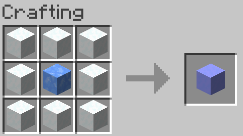
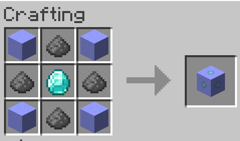
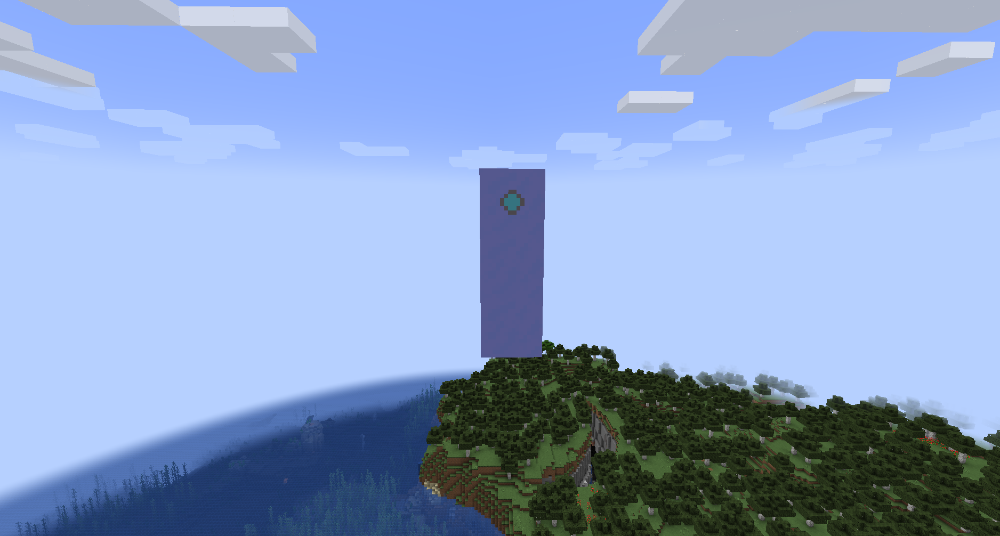

# More Snow
A simple Minecraft mod that adds a new type of snow to the game

## Features
### Blue Snow Block
This snow block can be crafted using one Blue Ice block and eight regular snow blocks. It will allow you to summon a Blue Snow Golem. This block drops 4 blue snowballs when broken without Silk Touch. These blue snowballs give an effect similar to powder snow when they hit entities.

**Craft:**

### Blue Snow Golem Core
This block is essential for the blue snow golem to appear.

**Craft:**

### Blue Snow Golem
This entity is a dumb snow golem, it serves only one purpose: to attract creepers.

It can be spawned using this block sequence:

### Cold Protect
This enchantment is applied to your boots. It allows you to move through powder snow even if you don’t have leather boots. It can be obtained via an enchantment table.

## License
This code is under [CC0-1.0](LICENSE) license.
